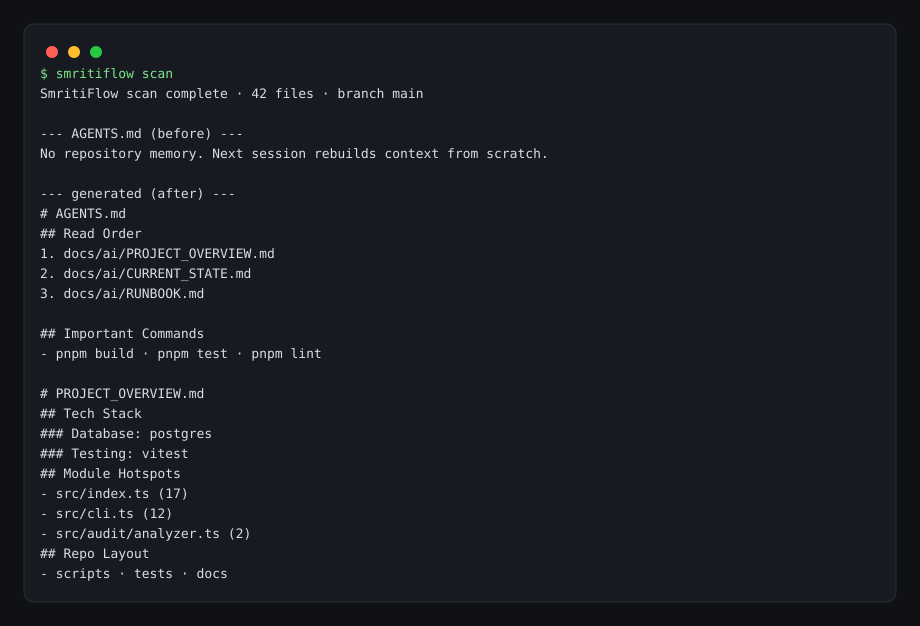

# SmritiFlow

[](https://www.npmjs.com/package/smritiflow)
[](https://www.npmjs.com/package/smritiflow)
[](https://github.com/subhajitlucky/smritiflow/actions/workflows/ci.yml)

SmritiFlow is a CLI for maintaining living repository memory for coding agents. It scans a codebase, writes structured artifacts, and generates concise agent-facing docs so work can be resumed with current context instead of guesswork.

Fresh agent sessions re-read the same repository and still miss what changed, what is active, and how to run things. SmritiFlow answers that with one scan: a project map, a current-state report, and a runbook that agents and humans read before starting work.

- Status: Published CLI
- Portfolio case study: <https://subhajitpradhan.vercel.app/projects/smritiflow>
- Inspect the implementation: `apps/cli`, `packages/core/src`, `tests`, and `.agents/skills/smritiflow/SKILL.md`


## Quick Start

```bash
npm install -g smritiflow      # or: npx smritiflow <command>
smritiflow init                # once per repository
smritiflow scan                # before substantial work
smritiflow status              # before resuming
smritiflow refresh             # after meaningful changes
smritiflow resume              # when returning to the codebase
smritiflow hook                # at agent session start
```

Both command names are supported: `smritiflow` and `sf`. Install locally with `npm install --save-dev smritiflow` and run through `npx smritiflow <command>`.

| Command | What it does |
| --- | --- |
| `init` | Initialize repository memory files |
| `scan` | Run a full scan and generate all artifacts |
| `refresh` | Update memory after repository changes |
| `status` | Report freshness and stale signals |
| `resume` | Print a focused resume brief |
| `hook` | Print a session-start brief for an agent harness |
| `check` | Exit non-zero when committed memory has drifted from the code |

Every command accepts a global `--json` flag (also `SMRITIFLOW_JSON=1`) and
prints a machine-readable object instead of human text. An agent can consume
`smritiflow status --json` directly rather than scraping prose.

## Enforcing Freshness In CI

`smritiflow check` fails when the committed `docs/ai/*`, `AGENTS.md`, and
`.smritiflow/project-map.json` no longer match what a fresh scan would produce.
It runs as part of `pnpm validate`, so CI fails on drift.

This is a **drift** check rather than a staleness check. Staleness compares a
scan against your local working tree and is meaningless in CI, where the
fingerprint baseline is gitignored and the tree is whatever the commit contains.
Drift is the enforceable property: the committed documents should describe the
committed code.

`check` never writes. Running it cannot make a drifted repository look clean.

Point-in-time snapshots are excluded by design, since a fresh generation can
never match them: `docs/ai/CURRENT_STATE.md`, `.smritiflow/scan-report.json`, and
`.smritiflow/cache.json`.

## Wiring It Into an Agent Harness

`smritiflow hook` exists so memory arrives without the agent having to ask for
it. Point a session-start hook at it:

```bash
smritiflow hook session-start
```

The brief states whether memory is fresh, which files to read first, the active
areas, the uncommitted changes, and any open TODO/FIXME markers. Wire it as a
SessionStart hook in Claude Code, or call it from whatever bootstrap step your
harness runs.

## What It Generates

| Artifact | Contents |
| --- | --- |
| `.smritiflow/cache.json` | Last scan/refresh times, recorded commit, content fingerprints |
| `.smritiflow/project-map.json` | Detected stack, routes, module-graph hotspots |
| `.smritiflow/scan-report.json` | Branch, commit, recent commits, changed files, active areas, stale warnings |
| `AGENTS.md` | Managed memory block between SmritiFlow markers |
| `docs/ai/PROJECT_OVERVIEW.md` | What the project is, routes, hotspots |
| `docs/ai/CURRENT_STATE.md` | What changed recently and which areas are active |
| `docs/ai/RUNBOOK.md` | Install, dev, test, lint, and build commands |



## Artifact Schema

Every `--json` result and every artifact file records `schemaVersion`, currently
`2`. Bump `ARTIFACT_SCHEMA_VERSION` when a field is removed, renamed, or changes
meaning. A cache written by an older schema is rebuilt rather than compared, so
an upgrade never silently reads a stale shape.

## Behavior Notes

- **Content-fingerprint refresh**: `refresh` compares SHA-256 fingerprints of every hashable file against the previous run. Change detection therefore does not depend on git: repositories without git history, and repositories whose recorded commit was rewritten by a rebase, still detect edits correctly. Git supplies branch, commit, and recent-commit metadata only.
- **Self-excluding output**: SmritiFlow never fingerprints its own generated files, so a scan cannot report its own output as a repository change.
- **Targeted refresh**: a partial refresh re-runs only the analyzers whose inputs changed. Manifest changes, fingerprint-strategy changes, schema changes, and very large change sets fall back to a full scan.
- **Idempotent scans**: consecutive scans of an unchanged repository produce identical artifacts. SmritiFlow's own output is excluded from the file tree and the layout analysis, so a scan never reports files that its own previous run created.
- **Ignore handling**: scans respect the repository `.gitignore` and always exclude `node_modules/`, `dist/`, `build/`, `.next/`, `coverage/`, `.turbo/`, `.smritiflow/`, and `docs/ai/` at any depth. Hidden directories such as `.github/` are included.
- **Multi-language**: source, config, and manifest classification covers TypeScript, JavaScript, Vue, Svelte, Astro, Python, Go, Rust, Ruby, PHP, Java, Kotlin, Swift, C#, Scala, Dart, Elixir, shell, SQL, GraphQL, protobuf, and Terraform. Routes are detected from filesystem conventions (Next.js app and pages routers) and from declarations in FastAPI, Flask, Express, Fastify, Koa, Spring, Go `net/http`, and Rails. Runbooks and `AGENTS.md` blocks use the toolchain actually present — `uv`, `poetry`, `pip`, `go`, `cargo`, `bundler`, `composer`, `maven`, `gradle`, or a Node package manager — instead of assuming `npm` or `pnpm`.
- **Honest import graph**: every import edge is resolved to a file, deduplicated, and ranked by inbound usage, so "most depended-upon modules" means what it says. External packages, import cycles (Tarjan), and never-imported files are reported separately.
- **Test files are excluded** from route and marker detection, so fixtures containing `app.get("/health")` are not reported as real routes.
- **Merge-safe `AGENTS.md`**: generated content lives inside `<!-- smritiflow:begin -->` / `<!-- smritiflow:end -->` markers. Hand-written content outside the block is preserved, and files without markers receive the managed block appended instead of being overwritten.

## Upgrading From 0.1.x

0.1 wrote its generated `AGENTS.md` block without markers. On 0.2 that old block
sits above `<!-- smritiflow:begin -->` and is preserved as hand-written content,
because the merge cannot tell generated text from yours. Delete it once, by
hand, after your first scan on 0.2.

0.2 also changes artifact schemas (`ScanReport` gains `addedFiles`,
`removedFiles`, `todos`, and `notes`; `CacheData` gains `hashStrategy`), and
`staleWarnings` now means staleness only. `.smritiflow/cache.json` is now
gitignored, so a fresh clone rebuilds its baseline on the first `refresh`.

## Agent Skill

This repository also exposes a `smritiflow` skill for agent workflows via `.agents/skills/smritiflow/SKILL.md`.

```bash
npx skills add subhajitlucky/smritiflow            # install the skill
npx skills add subhajitlucky/smritiflow --list     # optional discovery only
```

The skill is discoverable by the `skills` ecosystem and can surface on `skills.sh` through repo-based installation.

## Development

This repository uses `pnpm` for development; end users install the CLI with npm.

```bash
pnpm install
pnpm validate        # typecheck, tests, and build
```

Individual commands: `pnpm dev`, `pnpm typecheck`, `pnpm test`, `pnpm build`, `pnpm check`.

## Releases

Releases publish to npm through the GitHub Actions workflow (OIDC trusted publishing with an `NPM_TOKEN` fallback):

1. Bump the version in `apps/cli/package.json`
2. Push the change to `main`
3. Create and push a tag such as `v0.1.2`
4. Let the workflow publish the package

## Testing

Automated coverage includes repository root detection, language and config classification, package manager and toolchain detection, project identity parsing across manifests, stack detection heuristics, route extraction across frameworks, import-graph resolution with cycles, marker extraction, generated-document content, content-fingerprint change detection with and without git, and the scan/refresh/status/resume/hook flows including `--json` output.

## Requirements

Node.js 20 or later.

## License

MIT
